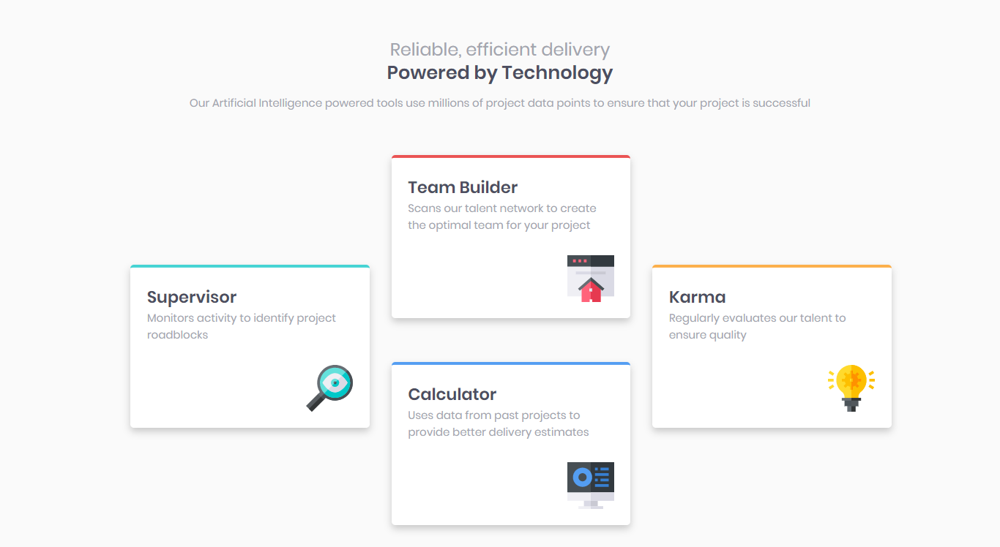

# Frontend Mentor - four-card-feature-section

## Welcome! 👋

Thanks for checking out this front-end coding challenge.

## Design Desktop

## Design Mobile

this challenge was done using react and stylus components

## This project was bootstrapped with Create React App

### Available Scripts

In the project directory, you can run:

### `npm start`
